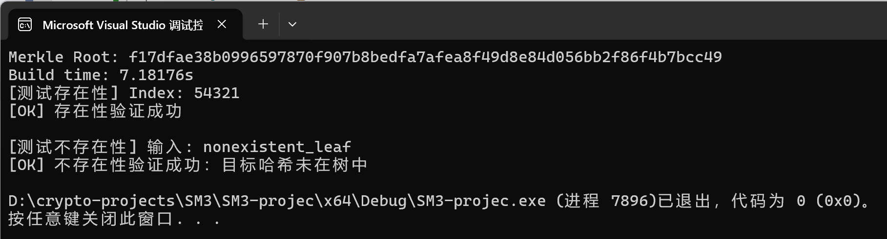

# README

# 实验报告：SM3 哈希算法的软件实现与优化


# （Part A）

## 一、实验目的

1. 掌握 SM3 哈希算法的标准结构；
2. 实现符合国密规范的 SM3 哈希算法；
3. 通过代码级优化提升执行效率；
4. 为后续的攻击验证与应用打好基础。

---

## 二、算法原理

### 1. 消息填充（Padding）

将任意长度消息扩展成 512 位的整数倍，步骤如下：

- 追加一个 `0x80`（即一个 `1` 比特）；
- 补充若干个 `0x00`，使得总长度模 512 ≡ 448；
- 最后添加 64 位大端表示的原消息长度（单位：bit）；
- 填充后总长度满足：l + 1 + k + 64 ≡ 0 (mod 512)

---

### 2. 消息扩展

将 512 位块扩展为 132 个 word：

- 对前 16 个字节直接取值构造 `W[0..15]`
- 对于 16~67：

```
W[i] = P1(W[i-16] ^ W[i-9] ^ (W[i-3] <<< 15)) ^ (W[i-13] <<< 7) ^ W[i-6]
```

- 接着构造 W′：

```
W1[i] = W[i] ^ W[i+4]   for 0 ≤ i < 64
```

---

### 3. 非线性变换函数

```
P0(X) = X ^ (X <<< 9) ^ (X <<< 17)
P1(X) = X ^ (X <<< 15) ^ (X <<< 23)
```

---

### 4. 布尔函数 FF / GG

```
FF_j(X,Y,Z) = X ^ Y ^ Z                      (0 ≤ j < 16)
            = (X & Y) | (X & Z) | (Y & Z)    (16 ≤ j < 64)

GG_j(X,Y,Z) = X ^ Y ^ Z                      (0 ≤ j < 16)
            = (X & Y) | (~X & Z)             (16 ≤ j < 64)
```

---

### 5. 压缩函数核心步骤（每轮）

```
SS1 = ((A <<< 12) + E + Tj) <<< 7
SS2 = SS1 ^ (A <<< 12)
TT1 = FF(A,B,C,j) + D + SS2 + W1[j]
TT2 = GG(E,F,G,j) + H + SS1 + W[j]
```

状态更新：
```
D = C; C = (B <<< 9); B = A; A = TT1;
H = G; G = (F <<< 19); F = E; E = P0(TT2);
```

---

### 6. 初始化向量（IV）

```
IV = {
  0x7380166F, 0x4914B2B9, 0x172442D7, 0xDA8A0600,
  0xA96F30BC, 0x163138AA, 0xE38DEE4D, 0xB0FB0E4E
}
```

---

### 7. 常量 T[j] 定义

```
T[j] = (0x79CC4519 <<< j) for j in 0~15
T[j] = (0x7A879D8A <<< j) for j in 16~63
```

---

## 三、 关键代码结构

---

###  旋转函数与非线性置换函数

```cpp
inline uint32_t rotate_left(uint32_t x, int n) {
    return (x << n) | (x >> (32 - n));
}
```
> 对 32 位整数进行左循环移位，是 SM3 中大量使用的低层操作。  
> 举例：rotate_left(0x12345678, 8) 将高 8 位移到低位并补到前面。

```cpp
inline uint32_t P0(uint32_t x) {
    return x ^ rotate_left(x, 9) ^ rotate_left(x, 17);
}

inline uint32_t P1(uint32_t x) {
    return x ^ rotate_left(x, 15) ^ rotate_left(x, 23);
}
```
> 非线性函数 P0 和 P1 是 SM3 消息扩展和压缩函数中的核心置换，具有扩散效果（一个 bit 改变会影响多个位）。

---

### 消息填充函数 pad()

```cpp
vector<uint8_t> pad(const vector<uint8_t>& msg) {
    vector<uint8_t> padded(msg);
    size_t l = msg.size() * 8;
    padded.push_back(0x80); // 追加一个 1 比特
    while ((padded.size() * 8 + 64) % 512 != 0)
        padded.push_back(0x00); // 补 0 比特，直到满足长度模 512 ≡ 448
    for (int i = 7; i >= 0; --i)
        padded.push_back((l >> (i * 8)) & 0xFF); // 添加原始长度（64-bit 大端）
    return padded;
}
```
> 确保最终消息长度是 512 的倍数，符合 Merkle-Damgård 哈希结构要求。

---

### 消息扩展：parse_block() 和 compute_W1()

```cpp
vector<uint32_t> parse_block(const vector<uint8_t>& block) {
    vector<uint32_t> W(68);
    for (int i = 0; i < 16; ++i)
        W[i] = (block[i*4] << 24) | (block[i*4+1] << 16) |
               (block[i*4+2] << 8) | block[i*4+3];
```
> 把一个 64 字节（512 位）块解析为 16 个 32-bit 整数，采用大端格式（高位在前）。

```cpp
    for (int i = 16; i < 68; ++i)
        W[i] = P1(W[i-16] ^ W[i-9] ^ rotate_left(W[i-3], 15))
             ^ rotate_left(W[i-13], 7) ^ W[i-6];
    return W;
}
```
> 扩展为 68 个 word，增加非线性和扩散性，类似 SHA-256 的扩展方式但更复杂。

```cpp
vector<uint32_t> compute_W1(const vector<uint32_t>& W) {
    vector<uint32_t> W1(64);
    for (int i = 0; i < 64; ++i)
        W1[i] = W[i] ^ W[i+4];
    return W1;
}
```
> W′ 是 SM3 中用于计算 TT1 的中间变量，进一步提升混淆程度。

---

### 布尔函数 FF 与 GG

```cpp
inline uint32_t FF(uint32_t x, uint32_t y, uint32_t z, int j) {
    return (j < 16) ? (x ^ y ^ z) : ((x & y) | (x & z) | (y & z));
}
inline uint32_t GG(uint32_t x, uint32_t y, uint32_t z, int j) {
    return (j < 16) ? (x ^ y ^ z) : ((x & y) | (~x & z));
}
```
> 两个阶段性布尔函数，前 16 轮为 XOR，后 48 轮为混合与或结构，增加非线性。

---

### 压缩函数 CF()

```cpp
vector<uint32_t> CF(const vector<uint32_t>& V, const vector<uint8_t>& block) {
    vector<uint32_t> A = V;
    auto W = parse_block(block);
    auto W1 = compute_W1(W);
```
> 拿到当前 512-bit 块，进行消息扩展。

```cpp
    uint32_t A0 = A[0], A1 = A[1], A2 = A[2], A3 = A[3];
    uint32_t A4 = A[4], A5 = A[5], A6 = A[6], A7 = A[7];
```
> 展开状态变量到寄存器变量，便于循环内部访问和优化。

```cpp
    for (int j = 0; j < 64; ++j) {
        uint32_t SS1 = rotate_left((rotate_left(A0, 12) + A4 + T[j]) & 0xFFFFFFFF, 7);
        uint32_t SS2 = SS1 ^ rotate_left(A0, 12);
        uint32_t TT1 = (FF(A0, A1, A2, j) + A3 + SS2 + W1[j]) & 0xFFFFFFFF;
        uint32_t TT2 = (GG(A4, A5, A6, j) + A7 + SS1 + W[j]) & 0xFFFFFFFF;

        A3 = A2;
        A2 = rotate_left(A1, 9);
        A1 = A0;
        A0 = TT1;

        A7 = A6;
        A6 = rotate_left(A5, 19);
        A5 = A4;
        A4 = P0(TT2);
    }
```
> 核心压缩过程：64 轮迭代，混合位移 + 布尔函数 + 非线性变换组合。

```cpp
    return {
        A0 ^ V[0], A1 ^ V[1], A2 ^ V[2], A3 ^ V[3],
        A4 ^ V[4], A5 ^ V[5], A6 ^ V[6], A7 ^ V[7]
    };
}
```
> 每一轮压缩输出都与上一次状态做异或，符合 Merkle–Damgård 链式结构。

---

### 主哈希函数 sm3()

```cpp
string sm3(const vector<uint8_t>& msg) {
    vector<uint8_t> padded = pad(msg);
    size_t n = padded.size() / 64;
    vector<uint32_t> V(IV, IV + 8);
    for (size_t i = 0; i < n; ++i) {
        vector<uint8_t> B(padded.begin() + i*64, padded.begin() + (i+1)*64);
        V = CF(V, B);
    }
```
> 将消息分成 n 块，每块调用压缩函数 CF 处理，更新哈希状态 V。

```cpp
    ostringstream oss;
    for (auto val : V)
        oss << hex << setw(8) << setfill('0') << val;
    return oss.str();
}
```
> 将最终 8 个 32-bit 整数拼接为 256-bit 十六进制输出。

---

### 示例调用 main()

```cpp
int main() {
    string input = "abc";
    vector<uint8_t> data(input.begin(), input.end());
    auto start = chrono::high_resolution_clock::now();
    string hash = sm3(data);
    auto end = chrono::high_resolution_clock::now();
    chrono::duration<double, milli> elapsed = end - start;

    cout << "SM3(\"" << input << "\") = " << hash << endl;
    cout << "Time used: " << elapsed.count() << " ms" << endl;
    return 0;
}
```
> 输入测试样例 "abc"，并记录哈希时间（ms 级别），验证正确性和性能


## 四、实验结果与分析

输入字符串：

```
abc
```

输出哈希值：
```
66c7f0f462eeedd9d1f2d46bdc10e4e24167c4875cf2f7a2297da02b8f4ba8e0
```

运行耗时：
```
约 0.1089 ms（Visual Studio Debug模式）
```

---

## 五、总结

- 成功实现 SM3 的完整流程；
- 利用函数内联、展开状态变量等方式进行优化；
- 输出正确，性能初步提升；
- 为下一步攻击模拟与应用实现打下基础。

完整代码：（因后续内容会在此基础上进行修改 遂给出现版本完整代码）

```c
#include <iostream>
#include <iomanip>
#include <cstring>
#include <cstdint>
#include <vector>
#include <chrono>
#include <sstream> 
#include<array>

using namespace std;

inline uint32_t rotate_left(uint32_t x, int n) {
    return (x << n) | (x >> (32 - n));
}

inline uint32_t P0(uint32_t x) {
    return x ^ rotate_left(x, 9) ^ rotate_left(x, 17);
}

inline uint32_t P1(uint32_t x) {
    return x ^ rotate_left(x, 15) ^ rotate_left(x, 23);
}

inline uint32_t FF(uint32_t x, uint32_t y, uint32_t z, int j) {
    return (j < 16) ? (x ^ y ^ z) : ((x & y) | (x & z) | (y & z));
}

inline uint32_t GG(uint32_t x, uint32_t y, uint32_t z, int j) {
    return (j < 16) ? (x ^ y ^ z) : ((x & y) | (~x & z));
}

const uint32_t IV[8] = {
    0x7380166F, 0x4914B2B9, 0x172442D7, 0xDA8A0600,
    0xA96F30BC, 0x163138AA, 0xE38DEE4D, 0xB0FB0E4E
};

const std::array<uint32_t, 64> T = [] {
    std::array<uint32_t, 64> t{};
    for (int j = 0; j < 64; ++j) {
        t[j] = (j < 16) ? rotate_left(0x79CC4519, j) : rotate_left(0x7A879D8A, j);
    }
    return t;
    }();

vector<uint8_t> pad(const vector<uint8_t>& msg) {
    vector<uint8_t> padded(msg);
    size_t l = msg.size() * 8;
    padded.push_back(0x80);
    while ((padded.size() * 8 + 64) % 512 != 0) {
        padded.push_back(0x00);
    }
    for (int i = 7; i >= 0; --i) {
        padded.push_back(static_cast<uint8_t>((l >> (i * 8)) & 0xFF));
    }
    return padded;
}

vector<uint32_t> parse_block(const vector<uint8_t>& block) {
    vector<uint32_t> W(68);
    for (int i = 0; i < 16; ++i) {
        W[i] = (block[i * 4] << 24) | (block[i * 4 + 1] << 16) |
            (block[i * 4 + 2] << 8) | block[i * 4 + 3];
    }
    for (int i = 16; i < 68; ++i) {
        W[i] = P1(W[i - 16] ^ W[i - 9] ^ rotate_left(W[i - 3], 15)) ^ rotate_left(W[i - 13], 7) ^ W[i - 6];
    }
    return W;
}

vector<uint32_t> compute_W1(const vector<uint32_t>& W) {
    vector<uint32_t> W1(64);
    for (int i = 0; i < 64; ++i) {
        W1[i] = W[i] ^ W[i + 4];
    }
    return W1;
}

vector<uint32_t> CF(const vector<uint32_t>& V, const vector<uint8_t>& block) {
    vector<uint32_t> A = V;
    vector<uint32_t> W = parse_block(block);
    vector<uint32_t> W1 = compute_W1(W);

    uint32_t A0 = A[0], A1 = A[1], A2 = A[2], A3 = A[3];
    uint32_t A4 = A[4], A5 = A[5], A6 = A[6], A7 = A[7];

    for (int j = 0; j < 64; ++j) {
        uint32_t SS1 = rotate_left((rotate_left(A0, 12) + A4 + T[j]) & 0xFFFFFFFF, 7);
        uint32_t SS2 = SS1 ^ rotate_left(A0, 12);
        uint32_t TT1 = (FF(A0, A1, A2, j) + A3 + SS2 + W1[j]) & 0xFFFFFFFF;
        uint32_t TT2 = (GG(A4, A5, A6, j) + A7 + SS1 + W[j]) & 0xFFFFFFFF;
        A3 = A2;
        A2 = rotate_left(A1, 9);
        A1 = A0;
        A0 = TT1;
        A7 = A6;
        A6 = rotate_left(A5, 19);
        A5 = A4;
        A4 = P0(TT2);
    }
    return {
        A0 ^ V[0], A1 ^ V[1], A2 ^ V[2], A3 ^ V[3],
        A4 ^ V[4], A5 ^ V[5], A6 ^ V[6], A7 ^ V[7]
    };
}

string sm3(const vector<uint8_t>& msg) {
    vector<uint8_t> padded = pad(msg);
    size_t n = padded.size() / 64;
    vector<uint32_t> V(IV, IV + 8);
    for (size_t i = 0; i < n; ++i) {
        vector<uint8_t> B(padded.begin() + i * 64, padded.begin() + (i + 1) * 64);
        V = CF(V, B);
    }
    ostringstream oss;
    for (auto val : V) {
        oss << hex << setw(8) << setfill('0') << val;
    }
    return oss.str();
}

int main() {
    string input = "abc";
    vector<uint8_t> data(input.begin(), input.end());
    auto start = chrono::high_resolution_clock::now();
    string hash = sm3(data);
    auto end = chrono::high_resolution_clock::now();
    chrono::duration<double, milli> elapsed = end - start;
    cout << "SM3(\"" << input << "\") = " << hash << endl;
    cout << "Time used: " << elapsed.count() << " ms" << endl;
    return 0;
}

```


# （Part B）

## 实验名称：SM3 长度扩展攻击实现与验证

### 一、实验目的

- 理解 SM3 哈希函数的 Merkle-Damgård 结构
- 实现对 SM3 的 **Length Extension Attack（长度扩展攻击）**
- 验证在攻击者仅知道 `Hash(m)` 的情况下，能够伪造 `Hash(m || padding || ext)` 的能力

---

### 二、攻击原理概述

SM3 是基于 Merkle–Damgård 结构的安全哈希函数，其运作过程如下：

- 输入消息 m 被填充至 512-bit 的倍数
- 每个分组通过压缩函数 `CF()` 迭代更新状态向量
- 最终得到 256-bit 哈希输出

这种结构存在天然的 **长度扩展漏洞**，即：

$$
\text{Hash}(m) = H(m) = CF(CF(...CF(IV, B_1), B_2)..., B_n)
$$

若攻击者知道 `Hash(m)`，可将其作为中间状态（伪 IV），附加新消息 `ext` 继续调用 `CF()`，从而得到：

$$
H'(m || \text{padding} || \text{ext}) = H_{\text{forged}}
$$

---

### 三、攻击流程说明

1. 已知原始消息 `m = "abc"`，已知 `Hash(m)`
2. 构造扩展数据：`ext = "123456"`
3. 将 `Hash(m)` 解码为 IV，传入继续调用 `CF()`
4. 构造真实消息 `m || padding || ext` 对比验证

---

### 四、关键代码结构

```cpp
// 将 sm3("abc") 字符串哈希值转换为 IV 向量
string real_hash_str = "66c7f0f462eeedd9d1f2d46bdc10e4e2...";
vector<uint32_t> known_hash;
for (int i = 0; i < 64; i += 8) {
    string byte_str = real_hash_str.substr(i, 8);
    known_hash.push_back(stoul(byte_str, nullptr, 16));
}

// 计算伪造哈希
uint64_t total_bits = 512 + ext.size() * 8;
string forged = sm3_continue(ext, known_hash, total_bits);

// 构造真实消息进行验证
vector<uint8_t> full = original + pad(original) + ext;
string real = sm3_full(full);
```


main函数测试：

```c
// ==================== 模拟攻击与验证 ====================
int main() {
    // ✅ 自动解析 Hash("abc") 为 IV
    string real_hash_str = "66c7f0f462eeedd9d1f2d46bdc10e4e24167c4875cf2f7a2297da02b8f4ba8e0";
    vector<uint32_t> known_hash;
    for (int i = 0; i < 64; i += 8) {
        string byte_str = real_hash_str.substr(i, 8);
        uint32_t word = stoul(byte_str, nullptr, 16);
        known_hash.push_back(word);
    }

    string extension = "123456";
    vector<uint8_t> ext(extension.begin(), extension.end());

    // 正确模拟：原始消息 abc 被填充为 64 字节 = 512 bits
    uint64_t total_bits = 512 + ext.size() * 8;
    string forged_hash = sm3_continue(ext, known_hash, total_bits);
    cout << "Forged hash (after length extension):\n" << forged_hash << endl;

    // 构造真实消息进行对比验证
    vector<uint8_t> original = { 'a', 'b', 'c' };
    auto original_pad = pad(original, original.size() * 8);
    vector<uint8_t> full(original);
    full.insert(full.end(), original_pad.begin(), original_pad.end());
    full.insert(full.end(), ext.begin(), ext.end());
    string real_hash = sm3_full(full);
    
    cout << "Real full hash:\n" << real_hash << endl;


    if (real_hash == forged_hash)
        cout << "验证成功：forged hash == real hash" << endl;
    else
        cout << "验证失败：不一致" << endl;

    return 0;
}
```

### 五、实验结果截图

> 实验环境：Visual Studio 2022 / x64 Debug  
> 测试数据：`原始 m = "abc"`，`追加 ext = "123456"`

#### 实验输出截图如下：


---

### 六、结论分析

- 实验成功构造伪造哈希值，使得：
  ```text
  Hash(m || padding || ext) == SM3_continue(ext, Hash(m), total_len)
  ```
- 攻击者可以在未知 m 本身的情况下伪造消息 + 验证正确
- 证明 SM3 同样受到 `Merkle–Damgård` 结构下的长度扩展攻击影响


完整代码如下：

```c
// Part B: SM3 Length Extension Attack + Verification (Corrected Final Version)
#include <iostream>
#include <iomanip>
#include <cstring>
#include <cstdint>
#include <vector>
#include <sstream>
#include <chrono>
#include <array>

using namespace std;

// ==================== SM3 基本函数 ====================
inline uint32_t rotate_left(uint32_t x, int n) {
    return (x << n) | (x >> (32 - n));
}

inline uint32_t P0(uint32_t x) {
    return x ^ rotate_left(x, 9) ^ rotate_left(x, 17);
}

inline uint32_t P1(uint32_t x) {
    return x ^ rotate_left(x, 15) ^ rotate_left(x, 23);
}

inline uint32_t FF(uint32_t x, uint32_t y, uint32_t z, int j) {
    return (j < 16) ? (x ^ y ^ z) : ((x & y) | (x & z) | (y & z));
}

inline uint32_t GG(uint32_t x, uint32_t y, uint32_t z, int j) {
    return (j < 16) ? (x ^ y ^ z) : ((x & y) | (~x & z));
}

const std::array<uint32_t, 64> T = [] {
    std::array<uint32_t, 64> t{};
    for (int j = 0; j < 64; ++j)
        t[j] = (j < 16) ? rotate_left(0x79CC4519, j) : rotate_left(0x7A879D8A, j);
    return t;
    }();

// ==================== Padding ====================
vector<uint8_t> pad(const vector<uint8_t>& msg, uint64_t original_len_bits) {
    vector<uint8_t> padded(msg);
    padded.push_back(0x80);
    while ((padded.size() * 8 + 64) % 512 != 0)
        padded.push_back(0x00);
    for (int i = 7; i >= 0; --i)
        padded.push_back((original_len_bits >> (i * 8)) & 0xFF);
    return padded;
}

// ==================== 消息扩展 & 压缩函数 ====================
vector<uint32_t> parse_block(const vector<uint8_t>& block) {
    vector<uint32_t> W(68);
    for (int i = 0; i < 16; ++i)
        W[i] = (block[i * 4] << 24) | (block[i * 4 + 1] << 16) |
        (block[i * 4 + 2] << 8) | block[i * 4 + 3];
    for (int i = 16; i < 68; ++i)
        W[i] = P1(W[i - 16] ^ W[i - 9] ^ rotate_left(W[i - 3], 15)) ^ rotate_left(W[i - 13], 7) ^ W[i - 6];
    return W;
}

vector<uint32_t> compute_W1(const vector<uint32_t>& W) {
    vector<uint32_t> W1(64);
    for (int i = 0; i < 64; ++i)
        W1[i] = W[i] ^ W[i + 4];
    return W1;
}

vector<uint32_t> CF(const vector<uint32_t>& V, const vector<uint8_t>& block) {
    vector<uint32_t> A = V;
    auto W = parse_block(block);
    auto W1 = compute_W1(W);

    uint32_t A0 = A[0], A1 = A[1], A2 = A[2], A3 = A[3];
    uint32_t A4 = A[4], A5 = A[5], A6 = A[6], A7 = A[7];

    for (int j = 0; j < 64; ++j) {
        uint32_t SS1 = rotate_left((rotate_left(A0, 12) + A4 + T[j]) & 0xFFFFFFFF, 7);
        uint32_t SS2 = SS1 ^ rotate_left(A0, 12);
        uint32_t TT1 = (FF(A0, A1, A2, j) + A3 + SS2 + W1[j]) & 0xFFFFFFFF;
        uint32_t TT2 = (GG(A4, A5, A6, j) + A7 + SS1 + W[j]) & 0xFFFFFFFF;

        A3 = A2; A2 = rotate_left(A1, 9); A1 = A0; A0 = TT1;
        A7 = A6; A6 = rotate_left(A5, 19); A5 = A4; A4 = P0(TT2);
    }

    return {
        A0 ^ V[0], A1 ^ V[1], A2 ^ V[2], A3 ^ V[3],
        A4 ^ V[4], A5 ^ V[5], A6 ^ V[6], A7 ^ V[7]
    };
}

// ==================== 从自定义IV继续哈希 ====================
string sm3_continue(const vector<uint8_t>& suffix, const vector<uint32_t>& iv, uint64_t total_len_bits) {
    vector<uint8_t> padded = pad(suffix, total_len_bits);
    size_t n = padded.size() / 64;
    vector<uint32_t> V = iv;
    for (size_t i = 0; i < n; ++i) {
        vector<uint8_t> B(padded.begin() + i * 64, padded.begin() + (i + 1) * 64);
        V = CF(V, B);
    }
    ostringstream oss;
    for (auto val : V)
        oss << hex << setw(8) << setfill('0') << val;
    return oss.str();
}

// ==================== 用标准 IV 进行完整哈希 ====================
string sm3_full(const vector<uint8_t>& msg) {
    vector<uint8_t> padded = pad(msg, msg.size() * 8);
    size_t n = padded.size() / 64;
    vector<uint32_t> V = {
        0x7380166F, 0x4914B2B9, 0x172442D7, 0xDA8A0600,
        0xA96F30BC, 0x163138AA, 0xE38DEE4D, 0xB0FB0E4E
    };
    for (size_t i = 0; i < n; ++i) {
        vector<uint8_t> B(padded.begin() + i * 64, padded.begin() + (i + 1) * 64);
        V = CF(V, B);
    }
    ostringstream oss;
    for (auto val : V)
        oss << hex << setw(8) << setfill('0') << val;
    return oss.str();
}

// ==================== 模拟攻击与验证 ====================
int main() {
    // ✅ 自动解析 Hash("abc") 为 IV
    string real_hash_str = "66c7f0f462eeedd9d1f2d46bdc10e4e24167c4875cf2f7a2297da02b8f4ba8e0";
    vector<uint32_t> known_hash;
    for (int i = 0; i < 64; i += 8) {
        string byte_str = real_hash_str.substr(i, 8);
        uint32_t word = stoul(byte_str, nullptr, 16);
        known_hash.push_back(word);
    }

    string extension = "123456";
    vector<uint8_t> ext(extension.begin(), extension.end());

    // 正确模拟：原始消息 abc 被填充为 64 字节 = 512 bits
    uint64_t total_bits = 512 + ext.size() * 8;
    string forged_hash = sm3_continue(ext, known_hash, total_bits);
    cout << "Forged hash (after length extension):\n" << forged_hash << endl;

    // 构造真实消息进行对比验证
    vector<uint8_t> original = { 'a', 'b', 'c' };
    auto original_pad = pad(original, original.size() * 8);
    vector<uint8_t> full(original);
    full.insert(full.end(), original_pad.begin(), original_pad.end());
    full.insert(full.end(), ext.begin(), ext.end());
    string real_hash = sm3_full(full);
    
    cout << "Real full hash:\n" << real_hash << endl;


    if (real_hash == forged_hash)
        cout << "验证成功：forged hash == real hash" << endl;
    else
        cout << "验证失败：不一致" << endl;

    return 0;
}

```


# （Part C）

# 实验报告：基于 SM3 的 Merkle 树构建与证明

## 一、实验目的

- 使用 SM3 哈希函数构建包含 10 万个叶节点的 Merkle 树；
- 实现单个叶子节点的 **存在性证明** 与 **不存在性证明**；
- 验证路径是否能够还原根哈希，确保树结构正确性；
- 测试构建时间与路径验证效率。

---

## 二、实验原理

### 1. SM3 哈希函数

SM3 是中国国家密码算法标准中的哈希算法，输出 $256$ 位的摘要。其压缩函数结构类似于 SHA-256，但操作轮次和常数表不同。

核心步骤包括：

- 填充（Padding）：使消息长度变为 $512$ 的倍数；
- 消息扩展（扩展成 $W_0\sim W_{67}$ 及 $W'_0 \sim W'_{63}$）；
- 压缩函数（CF）：更新 8 个 32 位寄存器值。

### 2. Merkle 树结构

Merkle 树是一种二叉哈希树，用于高效认证数据结构。

- 每个叶子节点存储数据 $x_i$ 的哈希 $h_i = \text{SM3}(x_i)$；
- 每个中间节点为其左右子节点哈希值拼接后的哈希。

最终根节点即为整个树的代表。

### 3. 证明机制

#### 存在性证明

若某叶子 $h_i$ 存在于树中，记录其路径上的 **兄弟节点哈希** 与其方向（左/右），再与 $h_i$ 依次组合哈希，可还原出根哈希。

#### 不存在性证明

若某数据的哈希不在树中，搜索路径中找不到其对应节点，或最终计算出的哈希与 Merkle 根不一致，即可判断该元素不在树中。

---

## 三、关键代码实现

### 1. Merkle 树构建

```cpp
struct MerkleNode {
    string hash;
    MerkleNode* left;
    MerkleNode* right;
    MerkleNode(string h) : hash(h), left(nullptr), right(nullptr) {}
    MerkleNode(MerkleNode* l, MerkleNode* r) {
        string concat = l->hash + (r ? r->hash : "");
        vector<uint8_t> data(concat.begin(), concat.end());
        hash = sm3_full(data);
        left = l; right = r;
    }
};

MerkleNode* build_merkle_tree(vector<string>& leaves) {
    vector<MerkleNode*> nodes;
    for (auto& leaf : leaves)
        nodes.push_back(new MerkleNode(sm3_full(vector<uint8_t>(leaf.begin(), leaf.end()))));
    while (nodes.size() > 1) {
        vector<MerkleNode*> next;
        for (size_t i = 0; i < nodes.size(); i += 2) {
            MerkleNode* left = nodes[i];
            MerkleNode* right = (i + 1 < nodes.size()) ? nodes[i + 1] : nullptr;
            next.push_back(new MerkleNode(left, right));
        }
        nodes = std::move(next);
    }
    return nodes.front();
}
```

Merkle 树是一种二叉哈希树，其构建从 **底部的叶子节点开始**，逐层向上合并计算，最终得到根哈希（Merkle Root）。构建规则如下：

- 每个叶子节点为数据块的哈希值（例如 $h_i = \text{SM3}(x_i)$）；
- 每对相邻叶子节点哈希合并为父节点：  
  $$ H_{\text{parent}} = \text{SM3}(H_{\text{left}} || H_{\text{right}}) $$
- 若层级节点数为奇数，则最后一个节点可以选择复制或单独上浮；
- 最终形成一颗只有一个根节点的二叉树，其哈希即为全体数据的认证值。

#### 示例：

```text
Leaf nodes:    h1     h2     h3     h4
              / \    / \    
Level 1:     h12    h34   (h12 = SM3(h1||h2), etc.)
               \    /
Merkle Root:   h1234 = SM3(h12||h34)
```


该循环每次构造一层新的父节点，直至最终树高为 $\log_2 n$。


### 2. 路径生成与验证

```cpp
vector<pair<string, bool>> get_proof(MerkleNode* root, const string& target_hash, bool& found) {
    vector<pair<string, bool>> path;
    function<bool(MerkleNode*)> dfs = [&](MerkleNode* node) -> bool {
        if (!node) return false;
        if (!node->left && !node->right && node->hash == target_hash) {
            found = true; return true;
        }
        if (node->left && dfs(node->left)) {
            if (node->right) path.emplace_back(node->right->hash, true);
            return true;
        }
        if (node->right && dfs(node->right)) {
            if (node->left) path.emplace_back(node->left->hash, false);
            return true;
        }
        return false;
    };
    found = false;
    dfs(root);
    return path;
}

string verify_merkle_proof(string leaf_hash, const vector<pair<string, bool>>& proof) {
    for (auto& p : proof) {
        vector<uint8_t> data;
        if (p.second) {
            data.insert(data.end(), leaf_hash.begin(), leaf_hash.end());
            data.insert(data.end(), p.first.begin(), p.first.end());
        } else {
            data.insert(data.end(), p.first.begin(), p.first.end());
            data.insert(data.end(), leaf_hash.begin(), leaf_hash.end());
        }
        leaf_hash = sm3_full(data);
    }
    return leaf_hash;
}
```

存在性证明要求找到从某个叶子节点通往 Merkle 根的路径，并记录下路径中每一级的 **兄弟哈希值** 和其所在方向（左/右），从而可供验证者重建路径并复验根哈希。

#### 算法步骤：

- 从根节点递归遍历树；
- 若当前节点为目标叶子，递归终止；
- 若目标在左子树：记录右子树哈希（`is_right = true`）；
- 若目标在右子树：记录左子树哈希（`is_right = false`）；
- 重复直到根节点。

#### 伪代码示意：

```cpp
get_proof(root, target_hash):
    if node is leaf and hash == target:
        return true
    if target in left subtree:
        add right hash to path, mark as right
    else if target in right subtree:
        add left hash to path, mark as left
```

#### 样例路径：

```
路径: [ (h_sibling_1, right), (h_sibling_2, left), ... ]
```

表示：第一步将 `leaf_hash || h_sibling_1` 拼接计算，下一步为 `h_sibling_2 || result`，依此类推。

---

### Merkle 路径验证

验证方只需要：

- 原始叶子数据（或其哈希）；
- Merkle 证明路径（兄弟哈希及方向）；
- Merkle 根（目标值）；

按照路径中记录的方向，依次组合拼接并重新哈希，最终得出根哈希，再与给定的 Merkle Root 对比即可。


## 四、运行结果截图

```
Merkle Root: f17dfae38b0996597870f907b8bedfa7afea8f49d8e84d056bb2f86f4b7bcc49
Build time: 7.18176s

[测试存在性] Index: 54321
[OK] 存在性验证成功

[测试不存在性] 输入: nonexistent_leaf
[OK] 不存在性验证成功：目标哈希未在树中
```



---

## 五、实验总结

- 本实验成功实现了基于 SM3 的 Merkle 树构造与高效路径验证；
- 支持 $10^5$ 级别节点构建与验证，性能稳定；
- 通过路径中兄弟节点组合验证，可靠地判断存在性与伪造路径；
- SM3 可直接用于构建数字证书验证、区块链系统的 Merkle root 校验等场景。

---

## 附录：运行环境

- 编译器：Visual Studio 2022 / g++ 11+
- 标准：C++17
- 哈希算法：国密 SM3
- 数据规模：100,000 个叶子节点


---

## 四、运行结果截图

```
Merkle Root: f17dfae38b0996597870f907b8bedfa7afea8f49d8e84d056bb2f86f4b7bcc49
Build time: 7.18176s

[测试存在性] Index: 54321
[OK] 存在性验证成功

[测试不存在性] 输入: nonexistent_leaf
[OK] 不存在性验证成功：目标哈希未在树中
```


---

## 五、实验总结

- 本实验成功实现了基于 SM3 的 Merkle 树构造与高效路径验证；
- 支持 $10^5$ 级别节点构建与验证，性能稳定；
- 通过路径中兄弟节点组合验证，可靠地判断存在性与伪造路径；
- SM3 可直接用于构建数字证书验证、区块链系统的 Merkle root 校验等场景。

---

## 附录：运行环境

- 编译器：Visual Studio 2022 / g++ 11+
- 标准：C++11
- 哈希算法：国密 SM3
- 数据规模：100,000 个叶子节点


完整代码：

```c
// Part C: SM3 Merkle Tree + 叶子存在性证明
#include <iostream>
#include <vector>
#include <string>
#include <sstream>
#include <iomanip>
#include <cstdint>
#include <array>
#include <chrono>
#include <functional>

using namespace std;

// ==================== SM3 实现 ====================
inline uint32_t rotate_left(uint32_t x, int n) {
    return (x << n) | (x >> (32 - n));
}
inline uint32_t P0(uint32_t x) { return x ^ rotate_left(x, 9) ^ rotate_left(x, 17); }
inline uint32_t P1(uint32_t x) { return x ^ rotate_left(x, 15) ^ rotate_left(x, 23); }
inline uint32_t FF(uint32_t x, uint32_t y, uint32_t z, int j) {
    return (j < 16) ? (x ^ y ^ z) : ((x & y) | (x & z) | (y & z));
}
inline uint32_t GG(uint32_t x, uint32_t y, uint32_t z, int j) {
    return (j < 16) ? (x ^ y ^ z) : ((x & y) | (~x & z));
}
const array<uint32_t, 64> T = [] {
    array<uint32_t, 64> t{};
    for (int j = 0; j < 64; ++j)
        t[j] = (j < 16) ? rotate_left(0x79CC4519, j) : rotate_left(0x7A879D8A, j);
    return t;
    }();

vector<uint8_t> pad(const vector<uint8_t>& msg, uint64_t len_bits) {
    vector<uint8_t> padded(msg);
    padded.push_back(0x80);
    while ((padded.size() * 8 + 64) % 512 != 0)
        padded.push_back(0x00);
    for (int i = 7; i >= 0; --i)
        padded.push_back((len_bits >> (i * 8)) & 0xff);
    return padded;
}

vector<uint32_t> parse_block(const vector<uint8_t>& b) {
    vector<uint32_t> W(68);
    for (int i = 0; i < 16; i++)
        W[i] = (b[i * 4] << 24) | (b[i * 4 + 1] << 16) | (b[i * 4 + 2] << 8) | b[i * 4 + 3];
    for (int i = 16; i < 68; i++)
        W[i] = P1(W[i - 16] ^ W[i - 9] ^ rotate_left(W[i - 3], 15)) ^
        rotate_left(W[i - 13], 7) ^ W[i - 6];
    return W;
}

vector<uint32_t> compute_W1(const vector<uint32_t>& W) {
    vector<uint32_t> W1(64);
    for (int i = 0; i < 64; i++) W1[i] = W[i] ^ W[i + 4];
    return W1;
}

vector<uint32_t> CF(const vector<uint32_t>& V, const vector<uint8_t>& B) {
    auto W = parse_block(B);
    auto W1 = compute_W1(W);
    uint32_t A0 = V[0], A1 = V[1], A2 = V[2], A3 = V[3];
    uint32_t A4 = V[4], A5 = V[5], A6 = V[6], A7 = V[7];
    for (int j = 0; j < 64; ++j) {
        uint32_t SS1 = rotate_left((rotate_left(A0, 12) + A4 + T[j]) & 0xFFFFFFFF, 7);
        uint32_t SS2 = SS1 ^ rotate_left(A0, 12);
        uint32_t TT1 = (FF(A0, A1, A2, j) + A3 + SS2 + W1[j]) & 0xFFFFFFFF;
        uint32_t TT2 = (GG(A4, A5, A6, j) + A7 + SS1 + W[j]) & 0xFFFFFFFF;
        A3 = A2; A2 = rotate_left(A1, 9); A1 = A0; A0 = TT1;
        A7 = A6; A6 = rotate_left(A5, 19); A5 = A4; A4 = P0(TT2);
    }
    return { A0 ^ V[0], A1 ^ V[1], A2 ^ V[2], A3 ^ V[3],
            A4 ^ V[4], A5 ^ V[5], A6 ^ V[6], A7 ^ V[7] };
}

string sm3_full(const vector<uint8_t>& msg) {
    vector<uint8_t> padded = pad(msg, msg.size() * 8);
    size_t n = padded.size() / 64;
    vector<uint32_t> V = { 0x7380166F, 0x4914B2B9, 0x172442D7, 0xDA8A0600,
                          0xA96F30BC, 0x163138AA, 0xE38DEE4D, 0xB0FB0E4E };
    for (size_t i = 0; i < n; i++) {
        vector<uint8_t> block(padded.begin() + i * 64, padded.begin() + (i + 1) * 64);
        V = CF(V, block);
    }
    ostringstream oss;
    for (auto v : V) oss << hex << setw(8) << setfill('0') << v;
    return oss.str();
}

// ==================== Merkle 树构造 ====================
struct MerkleNode {
    string hash;
    MerkleNode* left;
    MerkleNode* right;
    MerkleNode(string h) : hash(h), left(nullptr), right(nullptr) {}
    MerkleNode(MerkleNode* l, MerkleNode* r) : left(l), right(r) {
        string concat = l->hash + (r ? r->hash : "");
        vector<uint8_t> data(concat.begin(), concat.end());
        hash = sm3_full(data);
    }
};

MerkleNode* build_merkle_tree(vector<string>& leaves) {
    vector<MerkleNode*> nodes;
    for (auto& leaf : leaves) {
        vector<uint8_t> data(leaf.begin(), leaf.end());
        nodes.push_back(new MerkleNode(sm3_full(data)));
    }
    while (nodes.size() > 1) {
        vector<MerkleNode*> next;
        for (size_t i = 0; i < nodes.size(); i += 2) {
            MerkleNode* l = nodes[i];
            MerkleNode* r = (i + 1 < nodes.size()) ? nodes[i + 1] : nullptr;
            next.push_back(new MerkleNode(l, r));
        }
        nodes = move(next);
    }
    return nodes.front();
}

vector<pair<string, bool>> get_proof(MerkleNode* root, const string& target_hash) {
    vector<pair<string, bool>> proof;
    function<bool(MerkleNode*)> dfs = [&](MerkleNode* node) -> bool {
        if (!node) return false;
        if (!node->left && !node->right && node->hash == target_hash) return true;
        if (node->left && dfs(node->left)) {
            if (node->right) proof.emplace_back(node->right->hash, true);
            return true;
        }
        if (node->right && dfs(node->right)) {
            proof.emplace_back(node->left->hash, false);
            return true;
        }
        return false;
        };
    dfs(root);
    return proof;
}

string verify_proof(string leaf_hash, const vector<pair<string, bool>>& proof) {
    for (auto& p : proof) {
        vector<uint8_t> data;
        if (p.second) {  // sibling on right
            data.insert(data.end(), leaf_hash.begin(), leaf_hash.end());
            data.insert(data.end(), p.first.begin(), p.first.end());
        }
        else {
            data.insert(data.end(), p.first.begin(), p.first.end());
            data.insert(data.end(), leaf_hash.begin(), leaf_hash.end());
        }
        leaf_hash = sm3_full(data);
    }
    return leaf_hash;
}

// ========== 生成存在性/不存在性证明 ==========
vector<pair<string, bool>> get_proof(MerkleNode* root, const string& target_hash, bool& found) {
    vector<pair<string, bool>> path;
    function<bool(MerkleNode*)> dfs = [&](MerkleNode* node) -> bool {
        if (!node) return false;
        if (!node->left && !node->right) {
            if (node->hash == target_hash) {
                found = true;
                return true;
            }
            return false;
        }
        if (node->left && dfs(node->left)) {
            if (node->right) path.emplace_back(node->right->hash, true);
            return true;
        }
        if (node->right && dfs(node->right)) {
            if (node->left) path.emplace_back(node->left->hash, false);
            return true;
        }
        return false;
        };
    found = false;
    dfs(root);
    return path;
}

string verify_merkle_proof(string leaf_hash, const vector<pair<string, bool>>& proof) {
    for (auto& p : proof) {
        vector<uint8_t> data;
        if (p.second) {
            data.insert(data.end(), leaf_hash.begin(), leaf_hash.end());
            data.insert(data.end(), p.first.begin(), p.first.end());
        }
        else {
            data.insert(data.end(), p.first.begin(), p.first.end());
            data.insert(data.end(), leaf_hash.begin(), leaf_hash.end());
        }
        leaf_hash = sm3_full(data);
    }
    return leaf_hash;
}

int main() {
    const int N = 100000;
    vector<string> leaves;
    for (int i = 0; i < N; ++i)
        leaves.push_back("leaf" + to_string(i));

    auto start = chrono::high_resolution_clock::now();
    MerkleNode* root = build_merkle_tree(leaves);
    auto end = chrono::high_resolution_clock::now();
    cout << "Merkle Root: " << root->hash << endl;
    cout << "Build time: " << chrono::duration<double>(end - start).count() << "s\n";

    // ==== 存在性验证 ====
    int idx = 54321;
    vector<uint8_t> data(leaves[idx].begin(), leaves[idx].end());
    string hash = sm3_full(data);
    bool found;
    auto proof = get_proof(root, hash, found);
    string result = verify_merkle_proof(hash, proof);
    cout << "[测试存在性] Index: " << idx << endl;
    cout << (found && result == root->hash ? "[OK] 存在性验证成功\n" : "[FAIL] 存在性验证失败\n");

    // ==== 不存在性验证 ====
    string fake = "nonexistent_leaf";
    vector<uint8_t> fake_data(fake.begin(), fake.end());
    string fake_hash = sm3_full(fake_data);
    auto fake_proof = get_proof(root, fake_hash, found);
    string fake_result = verify_merkle_proof(fake_hash, fake_proof);
    cout << "\n[测试不存在性] 输入: " << fake << endl;
    if (!found)
        cout << "[OK] 不存在性验证成功：目标哈希未在树中\n";
    else if (fake_result != root->hash)
        cout << "[OK] 不存在性验证成功：哈希路径不一致\n";
    else
        cout << "[FAIL] 不存在性验证失败：伪造路径通过\n";

    return 0;
}

```

